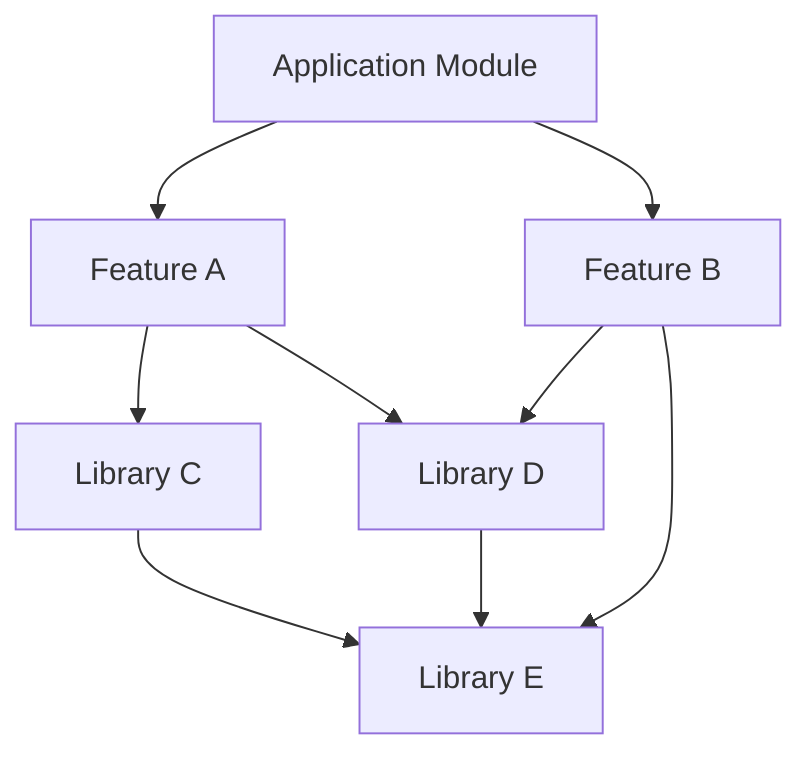
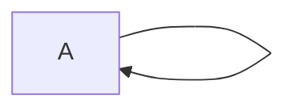
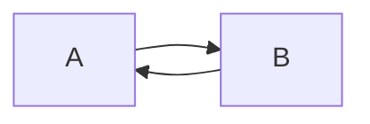
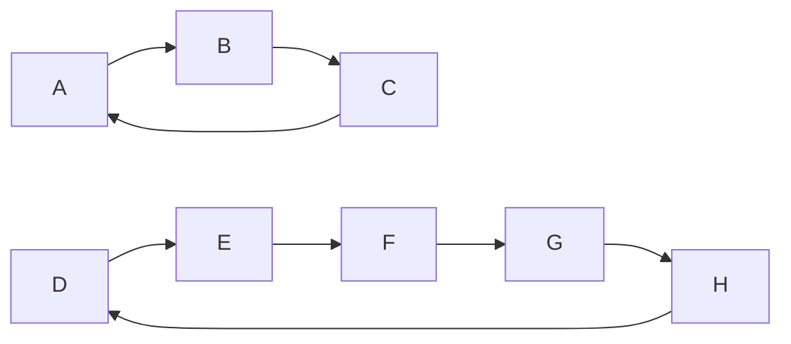
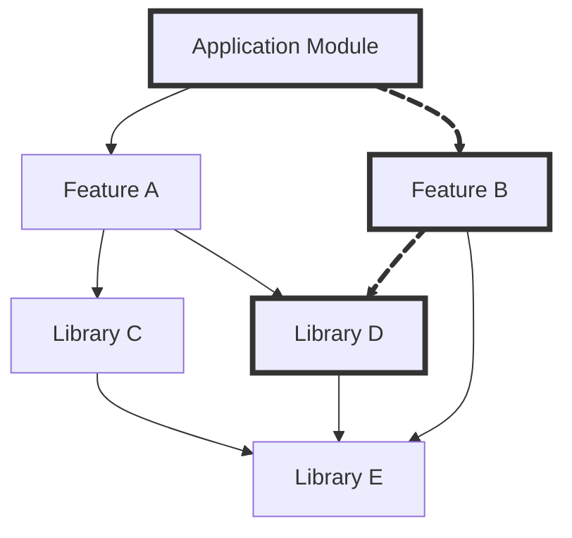
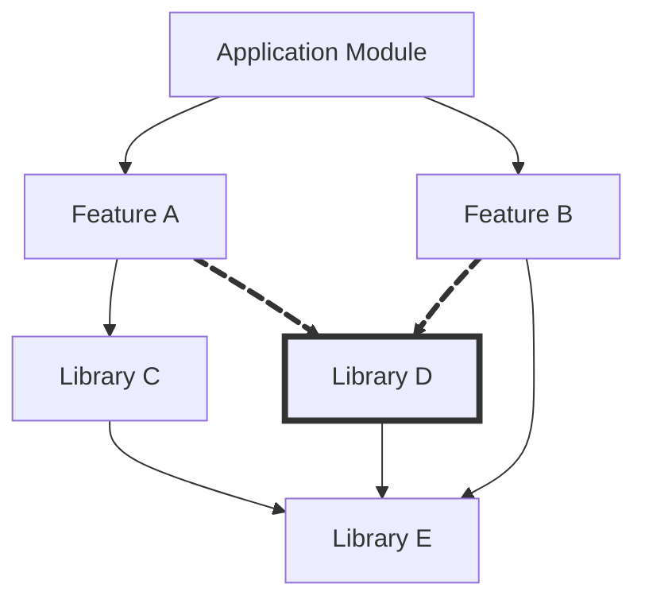
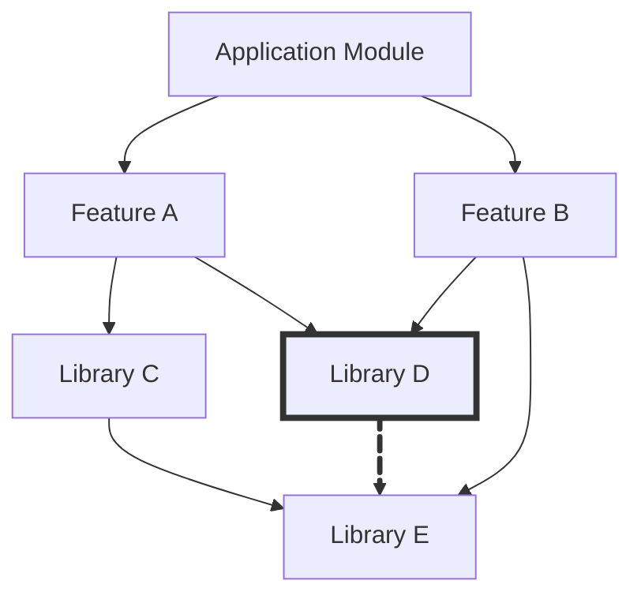
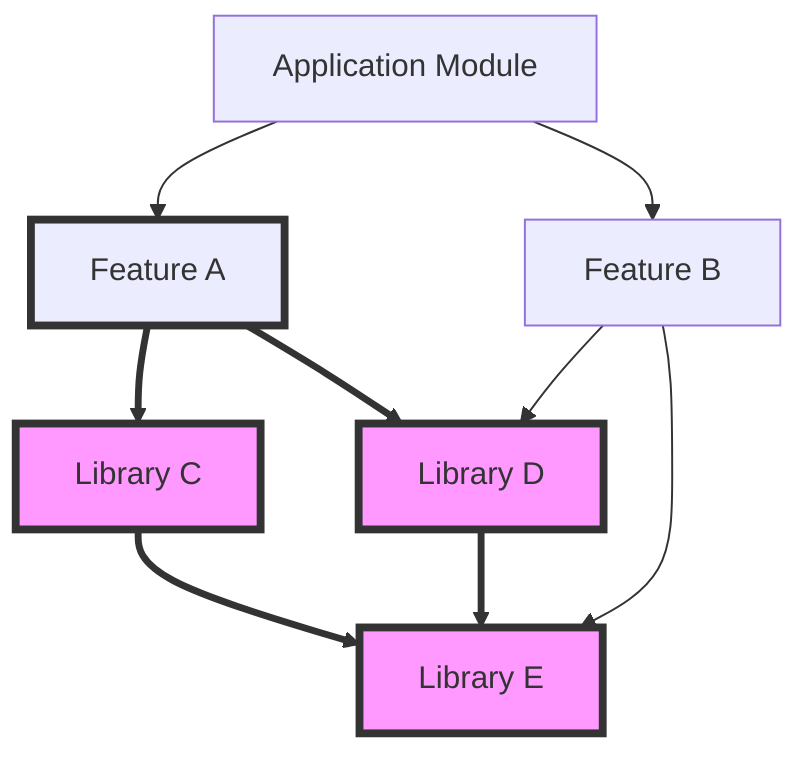
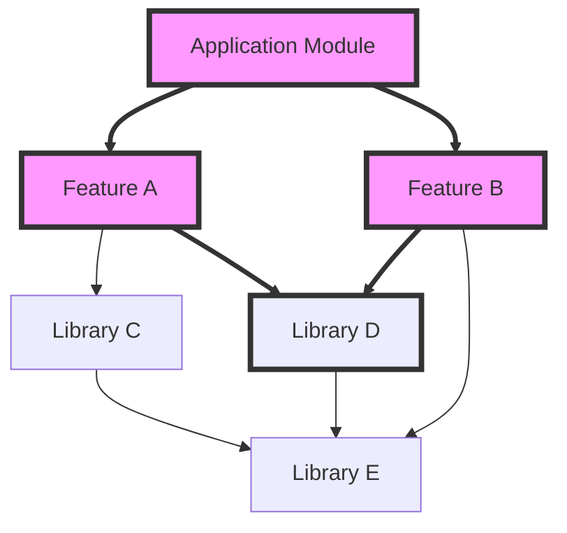

---
tags:
  - Architecture
---
# Dependency Graphs
When architecting an application, it can be helpful to consider your dependency graph.
This page outlines the general concepts of dependency graphs with the intent of defining terms, concepts, and properties that can be used to better reason about your dependency graph.
If you manage your dependency graph carefully, you can ensure a cleaner codebase as well as take advantage of build time optimizations like parallel module builds, compile avoidance, etc.
This page is intended as a primer for a future page about how to consider your dependency graph when architecting a codebase.
## Assumed Prior Knowledge
To understand this page, it is expected that you know

- Some basic graph theory definitions:
	- What a [graph](https://en.wikipedia.org/wiki/Graph_(discrete_mathematics)) is,
	- what a [directed graph](https://en.wikipedia.org/wiki/Directed_graph) is, and
	- what a [directed acyclic graph](https://en.wikipedia.org/wiki/Directed_acyclic_graph) is (which would include the definition of a [cycle](https://en.wikipedia.org/wiki/Cycle_(graph_theory))).

Reading through the linked wikipedia pages should sufficient, assuming I've written the rest of this page well enough.
Understanding other graph theory definitions and concepts (especially those specific to directed acyclic graphs) will be helpful, but I'll try to explain them where necessary.

## Assumptions of This Page

Here are the base assumptions I'll be making

- I'll be assuming that we are using a compiled language.
- A module cannot compile unless all of the modules it depends on have compiled.
- The number of modules is finite[^1].
## What is a Dependency Graph

To define a dependency graph, we'll first need to define a module.
For this page, define a **module** as a collection of code that compiles together into a well-defined a chunk of your codebase.
A module could be a file, a Java package, a Gradle module, etc.
I'll personally be using Gradle modules for my mental model of a module, because the intent of this page is to pave the way for discussing optimization of Gradle modular architecture.

A **dependency** in our code occurs when one module must "know" about the details of another module.
If module `A` must "know" about the details of module `B`, then we say that `A` **depends on** `B` and that `B` is a **dependency of** `A`.
This dependency may be explicit, as in `build.gradle` dependencies in a Gradle project.
Dependencies may also be implicit, as when considering Java packages which depend on each other through class-level imports.

The **dependency graph** of a collection of modules is the [directed acyclic graph](https://en.wikipedia.org/wiki/Directed_acyclic_graph) where the nodes represent the modules, and an edge is drawn from node `A` to node `B` if and only if `A` depends on `B`.
Here's a toy example that will be used throughout the rest of this page:

<figure>

</figure>

In this dependency graph `Application Module` depends on the modules `Feature A` and `Feature B`, `Feature B` depends on `Library D` and `Library E`, `Library E` has no dependencies, etc.

### Why is the Dependency Graph Acyclic?

The directedness of our dependency graphs arises naturally from the nature of dependencies: if module `A` depends on module `B`, then `A` needs to know about details of `B`, but `B` need not know that `A` even exists.
However, the necessity of the graph being acyclic may be less obvious.

To explore what it would mean to allow cycles in our dependency graph, let's first consider 1-cycles.
A 1-cycle would just mean that a module is dependent on itself.
We could argue that the module already inherently dependent on itself in a way (the module must "know" about its own code).
However, if we tried to explicitly declare a dependency on itself, then by our assumptions, we need it to compile before it can compile, which is clearly nonsense.
<figure>

</figure>

Expanding to a more sensical case, consider two modules, `A` and `B` which both depend on each other:
<figure>

</figure>
Suppose you attempt to compile module `A`.
Since module `A` depends on module `B`, we need to compile module `B` first.
But now we see that `B` depends on `A`, so to compile `B` we need to first compile `A`.
But since `A` depends on `B`, we need to first compile `B`...
As we can see, there's no way to resolve which module to compile first, so we can't compile either module.
Hence, we cannot allow a 2-cycle in our dependency graph to have a validly compilable codebase.

For any cycle larger than 2, consider the same argument and you will eventually see the same issue as we loop back to the first module you tried to build.
So, we can apply inductive reasoning to say that no cycle of any size can be allowed in our dependency graph in order to allow it to compile with the assumptions made at the start of this page.
<figure>

</figure>

## Useful properties of Directed Acyclic Graphs (DAGs)

Since dependency graphs are directed acyclic graphs (DAGs), it is helpful to define some terms and concepts from graph theory that will help us.

### Walks/Paths

First, a **walk** from node `A` to node `B` along a directed graph is a sequence of edges where the first edge starts at `A`, each subsequent edge starts at the node where the previous edge ended, and the final edge ends at `B`.
One can conceptually think of this as literally standing on node `A` and walking along the directed edges from node to node until they reach node `B`.
In a DAG, all walks are also **paths**, which have the additional feature that no node (or edge, for that matter) will be visited more than once.
The **length** of a walk/path is the number of edges in that walk/path

<figure>

<figcaption>A walk/path of length 2 from Application Module to Library D.</figcaption>
</figure>
### Height

The **height** of a node in a directed acyclic graph is the maximum length of all paths that start at that node.
In a dependency graph, the height of a module is the largest number of modules that must compile in serial before that module can compile. 
The **height** of a directed acyclic graph is the maximum height among the nodes in that graph.
This measure has build-time implications in a system that is capable of parallel compilation.

<figure>

<figcaption>The height of Feature B is 2. The height of the Application Module is 3. 
There are no nodes with height larger than 3, so the height of this dependency graph is 3.</figcaption>
</figure>
### Reachability
A node $B$ is **reachable** from a node $A$ if there exists a path from $A$ to $B$.
In this case, we can apply the notation $A\leq B$ as a [partial ordering](https://en.wikipedia.org/wiki/Partially_ordered_set).
Note that reachability is transitive, i.e. $A\leq B$ and $B\leq C$ implies $A \leq C$ (just concatenate the path from $A$ to $B$ and the path from $B$ to $C$ to get a path from $A$ to $C$).
An important feature of reachability in a dependency graph is that if $A \leq B$, then $B$ must compile before $A$.

<figure>

<figcaption>There is a path from Application Module to Library D, but no path from Library C to Library D.
So, Library D is reachable from the Application Module, but not reachable from Library C.</figcaption>
</figure>
### Degree

The **in-degree** of a node in a directed graph is the number of edges that point directly to that node.
In a dependency graph, the in-degree is the number of modules that directly depend on the given module.
<figure>

<figcaption>Library D has in-degree 2.</figcaption>
</figure>
The **out-degree** of a node in a directed graph is the number of edges that point away from that node.
The out-degree is the number of modules on which the given module directly depends.
<figure>

<figcaption>Library D has out-degree 1.</figcaption>
</figure>

The **out-reach** of a node is the number of nodes that are reachable from it.
In a dependency graph, the out-reach of a node is the number of modules that must compile before that node can compile.
<figure>

<figcaption>The Feature A module has out-reach of 3.</figcaption>
</figure>
The **in-reach** of a node is the number of nodes from which it is reachable.
In a dependency graph, the in-reach of a node is the number of modules that cannot compile until that node has compiled

<figure>

<figcaption>The Library D module has an in-reach of 3.</figcaption>
</figure>

Note that "in-reach" and "out-reach" are my own definitions, as I couldn't find any pre-existing definitions for these values[^2].

[^1]: Please don't think too hard about the implications of infinite modules. My background is in mathematics, so including this assumption is more of an academic compulsion than anything... Although, I admit that I am now thinking about the horrible horrible implications of infinite modules.

[^2]: If you know of established names that define these values, please contact me so I can update this page.
