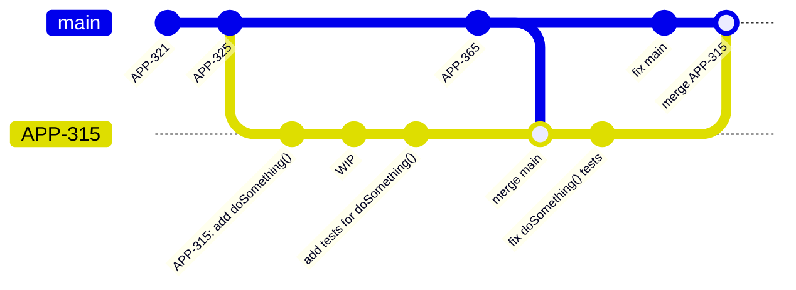
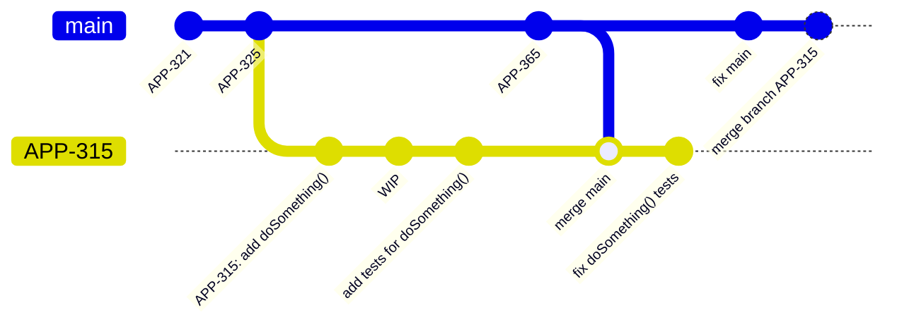
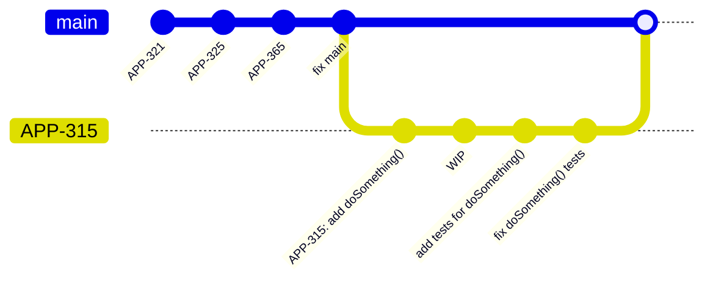
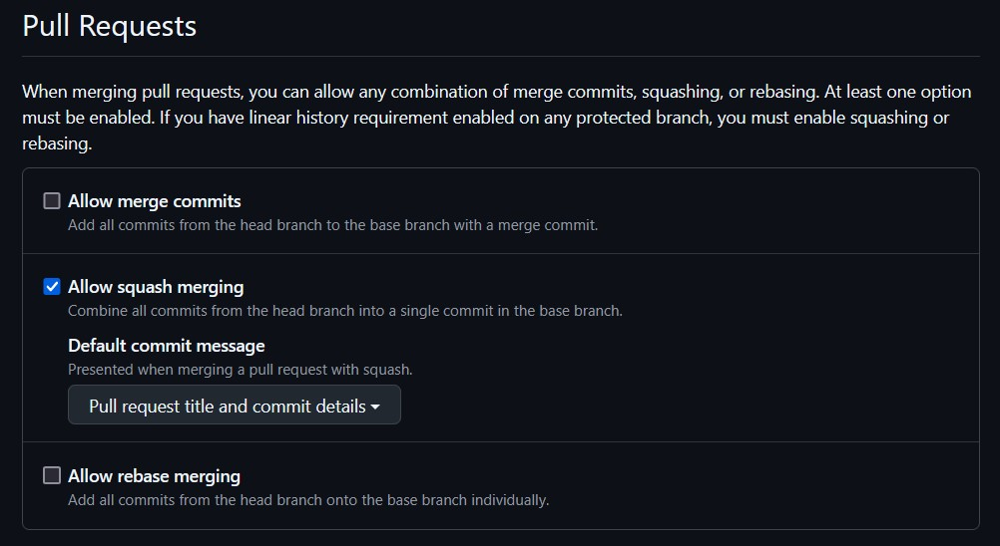
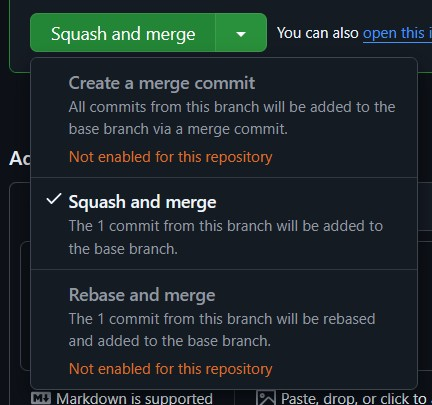

# Using the Squash Merge Strategy

## Assumed prior knowledge
To understand this page, it is assumed that you have a basic understanding of git branching and merging.

## TLDR

- Use the "squash and merge" option in your chosen remote version control solution as best practice when merging individual PRs.
- If your remote version control solution allows, restrict merges so this is the only option.
- If you're on the command line, the equivalent command is `git checkout target-branch && git merge working-branch --squash && git commit` to squash and merge `working-branch` into `target-branch`

## What is squashing in git?

In git, "squashing" a set of commits refers to the process turning those commits into a single equivalent commit.
There is no `git squash` command, but rather an option to `--squash` when performing certain other actions in git.
One _could_ manually squash commits by using a soft reset or an interactive rebase, but we're not going to get into that today.
The main focus is here is going to be using the squash merge strategy.

## Merging without squashing

Consider the following git commit graph where we create a branch named `APP-315`, make some commits, merge `main`, make another commit, then use a regular merge (`git merge APP-315`) to merge the branch back into `main`:


We see that at the point where the branch `APP-315` is merged back into `main`, the commit history will contain all commits from the branch.
This includes commits like the one labeled "WIP" and the one where we merged the `main` branch back into `APP-315`.
Here is what `git log --oneline` outputs:
```
361a520 (HEAD -> main) Merge branch 'APP-315'
f99f769 fix main
c58b907 (APP-315) fix doSomething() tests
ab3853f Merge branch 'main' into APP-316
1667cd0 APP-365: add bar
1de0234 add tests for doSomething()
20cf7f2 wip
2f0fde5 APP-315: add doSomething()
c3b49a2 APP-325
3273b5d APP-321
```
Suppose we wanted to try to find the commit where a regression was introduced (perhaps by [git bisect](https://git-scm.com/docs/git-bisect)).
I might try to run a test against the commits between the last known good commit and the first known bad commit, but there's no guarantee that something like the `wip` commit will even build, let alone that it doesn't introduce some other weird breaking behavior that was fixed before the `APP-315` branch was merged.
By merging this one branch, we have started to create a mess of our commit history.
By merging everyone's pull requests in this fashion on any sizable team, it is guaranteed that we have made a mess of our commit history.

## Squash and Merge
Now consider merging using the squash strategy.
The only thing that changes in our process is that rather than call `git checkout main && git merge APP-315`, we call `git checkout main && git merge APP-315 --squash && git commit -m "merge branch APP-315"`
Calling `git merge APP-315 --squash` ([docs](https://git-scm.com/docs/git-merge#Documentation/git-merge.txt---squash)) takes all of the commits in the `APP-315` branch and "squashes" them into a single commit, which then gets staged at the head of your currently checked out branch.
This leaves us with the following git graph

That last commit in the `main` branch represents all of the work that was done in the `APP-315` branch, but does not introduce the entire history of that branch into `main`.
The `APP-315` branch and its commits do all still exist, though, if we should need that history for some reason.
We now get a `git log --oneline` from the `main` branch that looks like this:
```
e5ace53 (HEAD -> main) merge branch APP-315
f99f769 fix main
1667cd0 APP-365: add bar
c3b49a2 APP-325
3273b5d APP-321
```
So now the git history has a single commit that represents merging branch `APP-315`.

Now suppose we want to find where a regression was introduced.
If every pull request into main is merged using the squash strategy, then we should expect to be able to build and test every[^1] commit to find the source of the regression.
Additionally, we are guaranteed that every commit in our history is a full unit of work with a meaningful change attached to it (no more "wip" or "merge main" commits). 

## Should we squash every merge?
If you have a development pattern where every pull request into the main branch is a singular unit of work, then I'd say "yes".
However, if you use feature branches that you target with pull requests until the feature is ready and then merge that branch into the main branch, then the answer changes to a "maybe".
It is likely worth keeping the history of the pull requests into the feature branch when you merge it into your main branch, so the final pull request that merges the feature branch into the main branch perhaps shouldn't be squashed.
Every pull request that is made _into_ the feature branch should be squashed, though.
The goal here is to reduce the noise from the working branches.

## Rebasing
For completeness, I should also mention rebasing, as remote tracking tools will have a "rebase and merge" option as well.
If we use that option to merge `APP-315` into `main`, then it will run a command along the lines of `git checkout APP-315 && git rebase main && git checkout main && git merge APP-315`.
As we can see, this performs a normal git merge, but first "rebases" the working branch.
All `git rebase branch-name` does is move the base commit of your working branch to the end of the given branch, so doing a rebase merge will keep your entire branch history but will prevent interleaving your branch's commits with commits already in `main`.
Doing a rebase commit with the example above will result in the following commit history:



The output of `git log --oneline`:
```
c58b907 (HEAD -> main, APP-315) fix doSomething() tests
1de0234 add tests for doSomething()
20cf7f2 wip
2f0fde5 APP-315: add doSomething()
f99f769 fix main
1667cd0 APP-365: add bar
c3b49a2 APP-325
3273b5d APP-321
```

As we can see, this is still a cleaner history than a regular in-place merge.
Squashed merges still give us a cleaner history overall, though.
I believe the optimal merge strategy is to always squash+merge except for feature branches, which should be rebased and merged (but should consist of squashed commits from PRs into the feature branch).

## Squashed merges and your remote tracking system

Most remote trackers (GitHub, GitLab, BitBucket, etc.) have built-in support for doing squashed merges.

### GitHub

On GitHub, you can set repository settings to allow/disallow regular merges, squashed merges, and rebased merges.
These settings can be found under the "General" area of the "Settings" tab on your repo (as an administrator):


As long as squash merges are allowed, you can select it as your merge strategy when merging a pull request.
Simply click the arrow next to the merge button and you will be given a chance to select your merge strategy from those allowed by the repository settings:


[^1]: In reality, we should only need to check $log_2(N)$ commits, where $N$ is the number of commits, if you're doing a binary search as with `git bisect`.